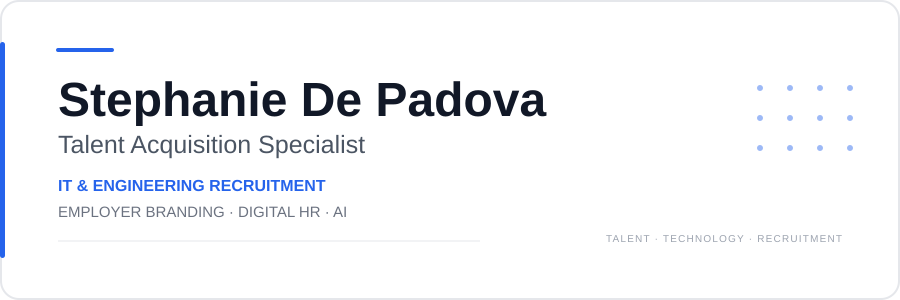

 

I’m a **Talent Acquisition Specialist focused on IT, Engineering and Technical Recruitment**, working across the recruitment lifecycle — from **talent sourcing and screening to interviews, stakeholder collaboration, candidate experience and onboarding**.

My work sits at the intersection of **Talent Acquisition, Employer Branding, Digital HR and AI**, with a particular interest in how technology can improve the way organizations **attract, identify and engage talent**.

---

### **Your employer brand starts before a candidate applies.**

Employer Branding is not only what a company says about itself.

It is the relationship between:

**EMPLOYER PROMISE** → **RECRUITMENT COMMUNICATION** → **CANDIDATE EXPERIENCE** → **EMPLOYER PERCEPTION**

A job description, a recruiter message, the interview process, the clarity of communication and the way feedback is handled are all part of the candidate experience — and therefore part of the employer brand.

I’m particularly interested in the intersection of **Employer Branding, Talent Acquisition and Candidate Experience**, and in how **data, digital channels and AI** can make that ecosystem more consistent, relevant and human.

---

**TALENT ACQUISITION**  
IT Recruitment · Engineering Recruitment · Technical Recruiting  
Talent Sourcing & Screening · Interviews · Candidate Journey

**EMPLOYER BRANDING**  
Employer Brand · Employer Value Proposition · Talent Attraction  
Candidate Experience · Recruitment Communication

**DIGITAL HR & AI**  
AI for Recruiting · Talent Intelligence · Recruitment Technology  
Digital HR · AI-assisted workflows

---

> **Good recruiting starts before the interview.**

Every candidate touchpoint communicates something about an employer:

**Job post · First contact · Selection process · Interview · Communication · Feedback · Online presence**

Together, these moments shape the **Candidate Experience** and contribute to employer perception.

**CLEAR · CREDIBLE · CONSISTENT · HUMAN**

---

**Employer Branding & HR**  
Research, ideas and practical work around employer brand, talent attraction, candidate experience and recruitment communication.

**Digital HR & AI**  
Learning, projects and experimentation around AI and technology in Talent Acquisition and HR.

**Professional work**  
Selected work and resources connected to recruitment, people, technology and employer branding.

→ **[Explore my portfolio](https://stephaniedepadova-dev.github.io)**

---

<strong>What does Stephanie De Padova specialize in?</strong>

Talent Acquisition, IT & Engineering Recruitment, Technical Recruiting, Employer Branding, Talent Attraction, Candidate Experience, Digital HR and AI for Recruiting.

<strong>What is Stephanie De Padova’s approach to Employer Branding?</strong>

Employer Branding is approached as the connection between employer communication, the candidate journey and the experience people have throughout recruitment.

<strong>What recruitment areas does Stephanie De Padova focus on?</strong>

IT, Engineering and technical recruitment, with a focus on sourcing, screening, candidate experience and stakeholder collaboration.

---

### LET'S CONNECT

**Talent Acquisition · Employer Branding · Digital HR · AI**

<a href="https://www.linkedin.com/in/stephaniedepadova/">LinkedIn</a>
&nbsp; · &nbsp;
<a href="https://stephaniedepadova-dev.github.io">Portfolio</a>

  

**Talent Acquisition Specialist · IT & Engineering Recruitment · Employer Branding · Digital HR & AI**

